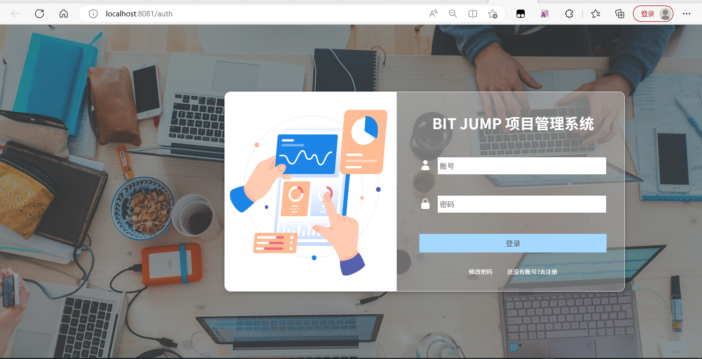

# initial-project

> 项目使用Vue-CLI搭建

## Project setup

```
npm install
```

### Compiles and hot-reloads for development
```
npm run serve
```

## Todo

- UI样式最终美化 + 通信段代码完成

## demo


最新版界面：



- 加入项目管理界面


### Customize configuration

See [Configuration Reference](https://cli.vuejs.org/config/).
